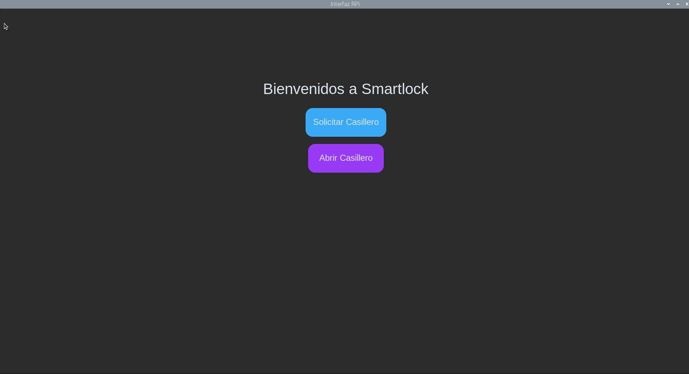
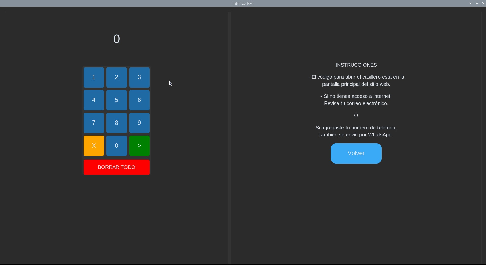
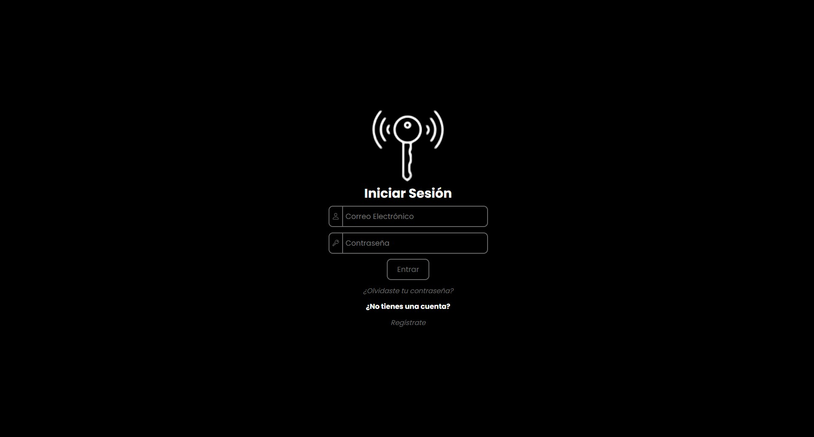
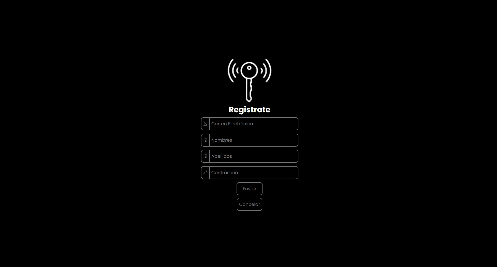
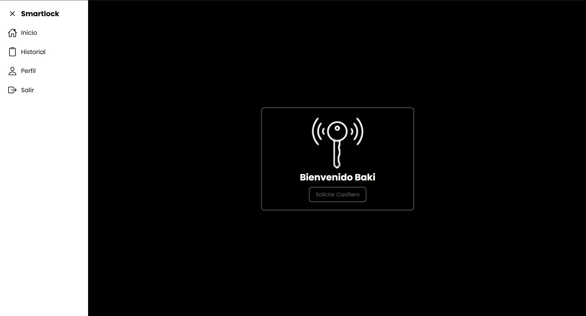
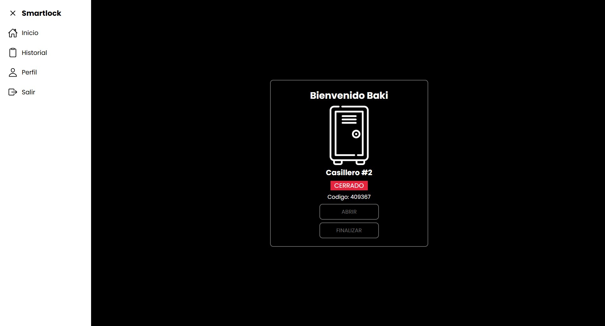
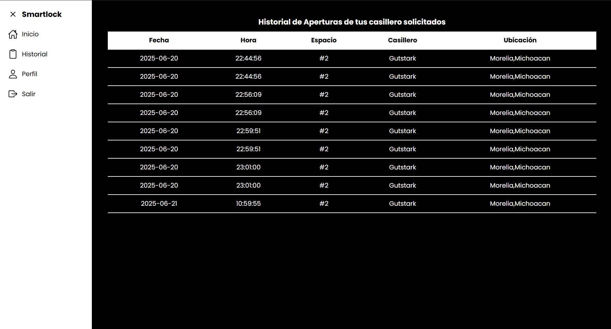
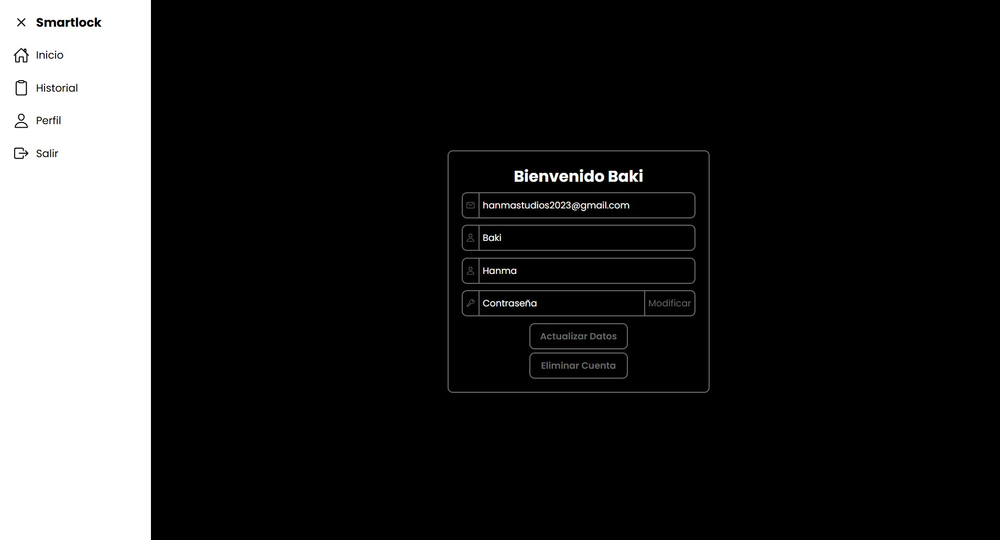

# 📦 Casillero Inteligente con Raspberry Pi y Aplicación Web

Este proyecto consiste en el desarrollo de un **casillero inteligente** controlado por una **Raspberry Pi** con pantalla táctil, y una **aplicación web** desde donde los usuarios pueden gestionar casilleros de forma remota.

----

## 🧠 Descripción General

El sistema está dividido en dos partes:

<div style="display: flex; align-items: center; gap: 8px;">
  <h3 style="margin: 0;">🧩 Software embebido</h3>
  
  
</div>

- Corre sobre **Raspberry Pi OS**.
- Controla sensores y cerraduras electrónicas.
- Proyecta una interfaz gráfica táctil desarrollada en **Python**.
- Se comunica con la web mediante **MQTT** para recibir comandos y enviar el estado de los sensores en tiempo real.

<div style="display: flex; align-items: center; gap: 8px;">
  <h3 style="margin: 0;">🌐 Sitio web</h3>
  
  
  
</div>

- Permite registrarse, iniciar sesión y gestionar credenciales.
- Permite solicitar casilleros y abrirlos de forma remota.
- Muestra el estado de los casilleros en tiempo real.
- Gestiona usuarios y casilleros usando una base de datos **MySQL**.
- Incluye un sistema de **alertas en tiempo real**, visibles en la interfaz y también enviadas por correo electrónico.
- Dispone de una **página de historial**, donde se puede consultar un registro completo de aperturas de casilleros por fecha y hora.

<h3>▶️ Video</h3>

<a href="https://www.youtube.com/watch?v=dOtBfZtQBb8" target="_blank">
  
</a>

----

## 🖼️ Capturas de pantalla

A continuación se muestran algunas capturas que ilustran el funcionamiento del sistema, tanto en la interfaz embebida (Raspberry Pi) como en la aplicación web.

### 🖲️ Interfaz táctil en Raspberry Pi

- **Ventana de navegación principal:**  
  Permite al usuario intercambiar entre distintas vistas
  
  

- **Ingreso de código:**  
  Panel numérico táctil donde el usuario puede introducir su código de acceso para abrir el casillero asignado.

  

### 🌐 Aplicación web (Flask)

- **Inicio de sesión:**  
  Interfaz donde los usuarios registrados pueden ingresar sus credenciales para acceder al sistema.

  

- **Registro de nuevo usuario:**  
  Formulario para crear una nueva cuenta, con validación de datos básica.

  

- **Pantalla principal (sin casillero asignado):**  
  Vista inicial del usuario recién registrado, con opción para solicitar un casillero.

  

- **Pantalla principal (con casillero asignado):**  
  Interfaz que muestra el número de casillero asignado, su estado, y opciones para abrirlo de forma remota.

  

- **Historial de aperturas:**  
  Registro cronológico de las aperturas realizadas por el usuario, con fechas, horas e información.

  

- **Perfil del usuario:**  
  Página donde el usuario puede ver y actualizar su información personal, así como cambiar su contraseña.

  

----

## 🛠️ Implementación del Proyecto

### 🧩 Raspberry Pi

#### 📦 Estructura del sistema

+ 📂**raspberry**
  + 📂**config**
    + ⚙️.env
  + 📜 **main.py**
  + 📜 **requirements.txt**
  + 🖼️ **qr.jpg**

#### 📦 Requisitos del Sistema

- Consigue una Raspberry Pi 4 Modelo B (2GB, 4GB o 8GB) en una tienda autorizada o en línea.


- Utiliza una memoria microSD de al menos 128 GB con Raspberry Pi OS preinstalado.


- Asegúrate de tener Python versión 3.x o superior instalado (incluido por defecto en Raspberry Pi OS).


- Contrata un servicio MQTT; para este proyecto se utilizó HiveMQ.

##### 📜 Librerias
Las siguientes librerías, con sus respectivas versiones, deben estar instaladas en Python:

-  Extensión de **tkinter** para crear interfaces gráficas.
-  Cliente para conectarse, publicar y suscribirse a un broker **MQTT**.
-  Biblioteca para manipulación de imágenes.
-  Carga variables de entorno desde un archivo **.env** para manejar configuraciones de forma segura.
-  Librería que permite controlar los pines **GPIO** de la Raspberry Pi para interactuar con hardware externo.

#### 📥 Instalación

#### Clonar el repositorio

```bash
git clone https://github.com/GustavoPatlan/smartlock.git
cd~ /raspberry
pip install -r requirements.txt
```
#### Crear variables de entorno

```bash
cd~ /raspberry/config
touch .env
nano .env
```
En el archivo **.env**, deben colocar:

- Las credenciales de su broker MQTT (dirección, puerto, usuario y contraseña).
- La información del locker (nombre, zona, ciudad y estado).

```bash
# Configuración MQTT
BROKER=
PORT=
USUARIO=
PASSWORD=

# Información del Locker
NOMBRE=         # Nombre del locker (ej. Sara)
ZONA=           # Zona o ubicación específica (ej. Periodismo)
CIUDAD=         # Ciudad o ubicación específica (ej. Guadalajara)
ESTADO=         # Estado o ubicación específica (ej. Jalisco)

```
Asegúrate de completar todos los campos con tus datos reales antes de guardar el archivo.

#### Cómo correr el software en Raspberry Pi

```bash
cd~ /smartlock
python3 main.py
```
### 🌐 Aplicación Web

#### 📦 Estructura del sistema

+ 📂**smartapp**
  + 📂**config**
    + 📜**db.py**
    + 📜**functions.py**
  + 📂**mqtt**
    + 📜**mqtt.py**
  + 📂**routes**
    + 📜**login.py**
    + 📜**user.py**
  + 📂**secret**
    + ⚙️.env
  + 📂**static**
    + 📜**css_files.css**
    + 📜**js_files.js**
    +  🖼️**pictures_files**
  + 📂**templates**
    + 📜**html_files.html**
  + 📜**info.py**
  + 📜**main.py**
  + 📜 **requirements.txt**
  + 🗄️ **db_estructura.sql**
 
#### 📦 Requisitos del Sistema


- Asegúrate de tener Python versión 3.x o superior instalado.


- Contrata un servicio MQTT; para este proyecto se utilizó HiveMQ.

##### 📜 Librerias
Las siguientes librerías, con sus respectivas versiones, deben estar instaladas en Python:

-  **Microframework** web en Python, ligero y flexible.
-  Extensión de Flask para enviar correos electrónicos desde una app web.
-  Añade soporte WebSocket a Flask para comunicación en tiempo real.
-  Conector oficial de Python para bases de datos **MySQL**.
-  Cliente para conectarse, publicar y suscribirse a un broker **MQTT**.
-  Carga variables de entorno desde un archivo **.env** para manejar configuraciones de forma segura.
-  Soporte para zonas horarias en Python.

#### 📥 Instalación

#### Clonar el repositorio

```bash
git clone https://github.com/GustavoPatlan/smartlock.git
cd smartapp
pip install -r requirements.txt
```
#### Instalar la estructura de la base de datos
✅ Opción 1: Usando la terminal (si tienes MySQL instalado)
- Abre la terminal o CMD.
- Accede a MySQL:

```bash
mysql -u tu_usuario -p
```
- Crea la base de datos (si aún no existe):

```bash
CREATE DATABASE smartlock;
```
- Sal de MySQL si entraste con el paso anterior (exit;) y ejecuta:

```bash
mysql -u tu_usuario -p smartlock < smartapp/db_estructura.sql
```
✅  Opción 2: Abrir el archivo .sql con un editor.
- Abre el archivo estructura.sql con un editor de texto o editor SQL.
- Conéctate a tu servidor MySQL.
- Asegúrate de haber creado la base de datos.
- Replica el contenido.
#### Crear variables de entorno

```bash
cd smartapp
mkdir -p secret
cd secret
type nul > .env
notepad .env
```
En el archivo **.env**, deben colocar:

- Las credenciales de su broker MQTT (host, puerto, usuario y contraseña).
- La clave secreta del smartlock.
- Los datos de configuración del correo (servidor SMTP, puerto, correo y contraseña).
- Las credenciales de acceso a la base de datos (host, usuario, contraseña y nombre de la base).

```bash
# Configuración MQTT
BROKER=
PORT=
USER=
PASSWORD=

# Smartlock
SECRETKEY=

# Correo
MAILSERVER=
MAILPORT=
MAILUSERNAME=
MAILPASSWORD=

# Base de Datos
DBHOST=
DBUSER=
DBPASSWORD=
DBDATABASE=
```
Asegúrate de completar todos los campos con tus datos reales antes de guardar el archivo.

#### Cómo correr el software en Raspberry Pi

```bash
cd smartapp
python main.py
```
## 🔗 Comunicación Web ↔️ Raspberry Pi
- Se utiliza MQTT para la comunicación bidireccional.
- Flask publica comandos (por ejemplo: abrir casillero).
- Raspberry publica estados (por ejemplo: casillero abierto o cerrado).
- Ambas partes usan paho-mqtt.
----
## 🧪 Pruebas del sistema

El sistema fue implementado y probado en un **casillero físico real**, el cual ya contaba con una estructura preestablecida que incluía:

- Sensores de especiales.
- Cerraduras automáticas (controladas desde GPIO)

### 🔧 Recomendaciones para pruebas sin el casillero real

Si no se dispone del hardware físico completo, se recomienda:

1. **Sensores**: Usar sensores simples como sensores infrarrojos (IR), ultrasónicos o pulsadores para simular la presencia de objetos o puertas abiertas.
2. **Cerraduras**: Simular el estado de apertura o cierre de las cerraduras usando **LEDs** conectados a los GPIOs.
3. **Interfaz táctil**: puede probarse directamente en la Raspberry Pi si tiene pantalla, o emularse en una pantalla externa.

### 📌 Pines GPIO

En el código de la Raspberry Pi (`smartlock/main.py` y módulos relacionados) se indica claramente:

- Qué pines están asignados a **sensores**
- Qué pines están asignados a **cerraduras**

Puedes usar esa información para conectar componentes reales o de simulación durante tus pruebas.

---

> 🧪 Tip: se recomienda hacer pruebas módulo por módulo:
> - Verificar primero la lectura de sensores en consola.
> - Luego controlar los LEDs (cerraduras simuladas).
> - Después integrar la comunicación MQTT con la app web.

----
## 👥 Autores
- Gustavo Andrey Patlan Cartagena
- José Alejandro Romero Álvarez
- Cristian Aguilar Alcaraz
- David Alejandro Castellanos Hernández
- Antonio Ayala Bibriezca
- Cristina Yuneiri Tapia Cerna

----
## 📄 Licencia

Este proyecto está bajo la Licencia MIT.
Consulta el archivo <a href="https://github.com/GustavoPatlan/smartlock/blob/main/LICENSE">LICENSE</a> para más información.